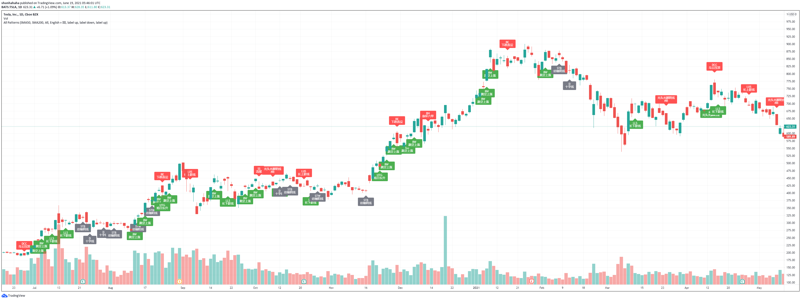
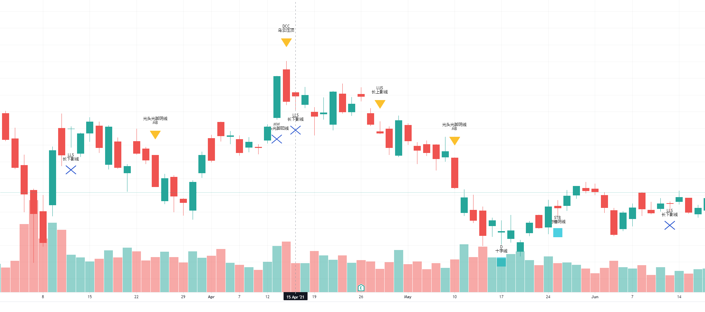
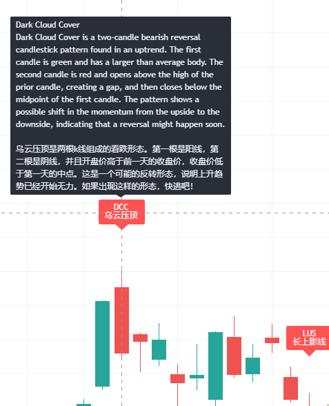
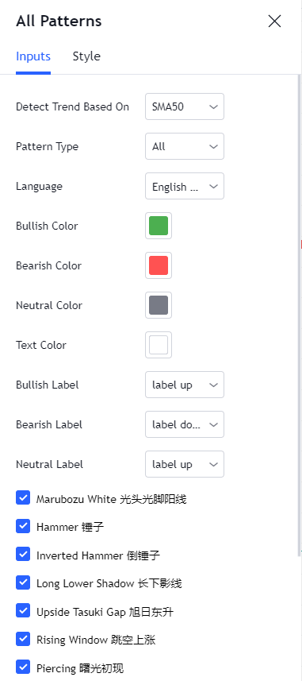

# All Candlestick Pattern Indicators
This is an enhanced version of candlestick pattern indicators in `TradingView`. Compared with the built-in one, it is more powerful since it has:  
✔️ optimized codes to run faster  
✔️ lots of filter options to see only your favorite indicators  
✔️ customization of label shapes and colors  
 

## 🚀 Preview
### Overview

### Customization

### Detailed Explanation

### So Many Options

## 🚀 Usage
### import
1) open tradingview
2) click `Pine Editor` on the buttom left
3) copy & paste `patterns.pine` to the Pine editor
4) click `Add to Chart` from the Pine editor

### change options
1) hover on the indicator name from the chart window  
2) click on the gear icon 

## 🚀 Available Options
### toggle individual indicators
  - show all (default)
  - show any subset of indicators

### filter indicators:
  - show all (default)
  - bullish only
  - bearish only
  - neutral only
  - except neutral
### toggle indicators based on candle numbers (WIP)
  - show all (default)  
  - 1 candle
  - 2 candles
  - 3+ candles
### color for { bullish, bearish, neutral } label and text:
  - { green, red, gray } and white (default)
  - any color you like
### shape for { bullish, bearish, neutral } label:
  - { label_up, label_up, label_down } (default)
  - [any shape](https://www.tradingview.com/pine-script-docs/en/v4/essential/Drawings.html?highlight=style_label_down#label-styles) supported by tradingview

### language: (WIP)
  - both (default)
  - English only
  - Chinese only
## 🚀 Bugs? Questions? Contributions?
Feel free to [open an issue](https://github.com/shunjizhan/react-folder-tree/issues), or create a pull request!
